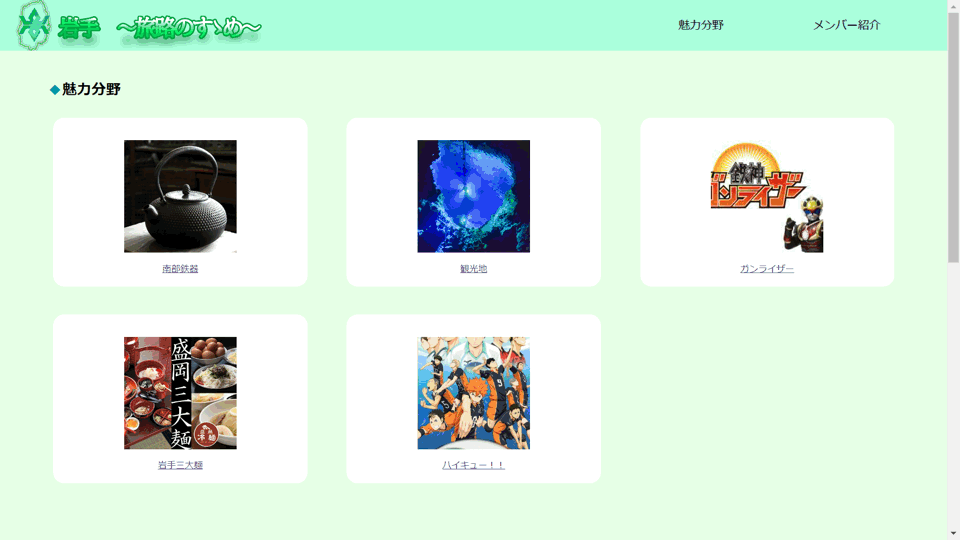

## BチームのWebサイト
---
岩手といえば何色のイメージがあるかをみんなで話し合った結果、  
緑という意見が出たので全体的に緑色のWebサイトにしました。  
また、ターゲットが若者ということから明るい緑を主体に色を決めました。  
  
ファビコンは岩手県の形とシンボルマークを使って作りました。  
ヘッダー部分の文字は目立つように輪郭、グラデーションを上手く使いました。  
indexの「魅力分野」「メンバー紹介」の部分を押すとそれぞれの対応した部分にとぶようにしています。  
また、それぞれのページの一番下には一番上に戻るボタンとホームに戻るボタンを入れています。  
---
## 魅力
- 南部鉄器
- 観光地
- ガンライザー
- 岩手三大麵
- ハイキュー!!
---
## メンバー
- 清水陽翔
- 盛合雅広
- 長崎大尊
- 田村亜弥
- 大森恋花
---
## ページサンプル
